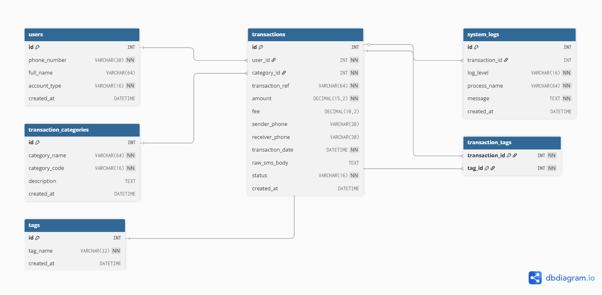

# 🏦 MoMo Data Pipeline

> A fullstack ETL pipeline that processes MTN MoMo SMS transaction data from XML, stores it in SQLite, and visualizes it on an interactive web dashboard.

---

## 👥 Team

**Team Name:** Team Nexus

| Name | Role |
|------|------|
| Ange Umukundwa | Team Member |
| Hugue Ishimwe | Team Member |
| Dan Gisa | Team Member |

---

## 📌 Project Description

This project processes raw MTN Mobile Money (MoMo) SMS data exported in XML format. The system cleans and categorizes each transaction, stores it in a SQLite database, and displays the results on an interactive web dashboard with charts and analytics.

### What it does:
- Parses raw MoMo SMS data from an XML file
- Cleans and normalizes dates, amounts, and phone numbers
- Categorizes transactions (incoming, outgoing, payments, etc.)
- Stores structured data in a SQLite database
- Displays analytics and charts on a web dashboard

---

## 🏗️ Architecture Diagram

> [ MoMo Data Pipeline Architecture](data/architecture.png)

---

## 🗄️ Database Design

### ERD Diagram

View the full interactive ERD on dbdiagram.io:
🔗 **[MoMo Data Pipeline — Interactive ERD](https://dbdiagram.io/d/MoMoDataPipeline-6a0ae8f3697f99c1679e4fb5)**

ERD diagram committed to this repository:



---

### Design Overview

The database was designed following **Third Normal Form (3NF)** to eliminate redundancy and ensure data integrity. The schema separates transaction categories into a dedicated lookup table so that category names are stored once and referenced by foreign key — not repeated across thousands of transaction rows. A dedicated `system_logs` table keeps ETL audit records separate from transaction data since they serve different purposes and lifecycles.

A **Many-to-Many relationship** between `transactions` and `tags` is resolved using the `transaction_tags` junction table, allowing multiple labels to be applied to a single transaction (e.g., "large-amount" and "suspicious") without changing the main schema. `DECIMAL(15,2)` was chosen for all monetary amounts to avoid floating-point precision errors. Strategic indexes were added on frequently queried columns such as `phone_number`, `transaction_date`, `category_id`, and `status` to optimize dashboard query performance.

---

### Database Tables

| Table | Type | Purpose |
|-------|------|---------|
| `users` | Core Entity | Stores every unique phone number involved in transactions |
| `transaction_categories` | Lookup Table | Defines the 7 types of MoMo transactions |
| `transactions` | Main Table | Stores every MoMo SMS transaction record |
| `system_logs` | System Table | Records all ETL pipeline activity and errors |
| `tags` | Supporting Entity | Flexible labels applied to transactions |
| `transaction_tags` | Junction Table | Resolves M:N relationship between transactions and tags |

---

### Relationships

```
users ──────────────────── transactions         (1 to Many)
transaction_categories ──── transactions         (1 to Many)
transactions ────────────── system_logs          (1 to Many)
transactions ↔ tags         via transaction_tags  (Many to Many)
```

---

### Transaction Categories

| Code | Category Name | Description |
|------|--------------|-------------|
| INCOMING | Incoming Money | Someone sent you money |
| TRANSFER | Transfer to Mobile | You sent money to another number |
| PAYMENT | Payment to Code | You paid a merchant using their MoMo code |
| BANK | Bank Deposit | Money moved between MoMo and bank |
| AIRTIME | Airtime Bill | You bought airtime using MoMo |
| FEE | Transaction Fee | Fee charged by MTN |
| OTHER | Other / Unknown | Does not match any known pattern |

---

### Database Files

| File | Description |
|------|-------------|
| 📊 [ERD Diagram](docs/erd_diagram.png) | Visual diagram of all tables and relationships |
| 📄 [Database Design Document](docs/Database_Design_Document.pdf) | Full design rationale, data dictionary, sample queries, and security rules |
| 🗃️ [SQL Setup Script](database/database_setup.sql) | Creates all tables, constraints, indexes, and sample data |
| 📋 [JSON Schemas](examples/json_schemas.json) | JSON representations of all main entities for API responses |

---

### Running the Database Setup

```bash
# MySQL
mysql -u root -p < database/database_setup.sql
```

---

## 📋 Scrum Board

> 🔗 https://trello.com/b/sPe6tdYP

---

## 🛠️ Tech Stack

| Layer | Technology |
|-------|------------|
| Data Parsing | Python (ElementTree / lxml) |
| Database | MySQL |
| Backend API | FastAPI *(optional/bonus)* |
| Frontend | HTML, CSS, JavaScript |
| Charts | Chart.js |
| Version Control | GitHub |

---

## 🚀 Getting Started

> *(Setup instructions will be added as the project develops)*

---

## 📁 Project Structure

```
momo-data-pipeline/
├── README.md                        # Project overview and setup guide
├── .env.example                     # Environment variable template
├── .gitignore                       # Files and folders excluded from GitHub
├── requirements.txt                 # Python dependencies
├── index.html                       # Dashboard entry point
│
├── docs/                            # Documentation and diagrams
│   ├── erd_diagram.png              # ERD diagram exported from dbdiagram.io
│   └── Database_Design_Document.pdf # Full database design document
│
├── database/                        # Database files
│   └── database_setup.sql           # SQL script to create all tables
│
├── examples/                        # JSON schema examples
│   └── json_schemas.json            # JSON representations of all entities
│
├── web/                             # Frontend files
│   ├── styles.css                   # Dashboard styling
│   ├── chart_handler.js             # Fetch and render charts/tables
│   └── assets/                      # Images and icons
│
├── data/                            # All data files
│   ├── raw/                         # Original XML input (git-ignored)
│   │   └── momo.xml
│   ├── processed/                   # Cleaned JSON output (git-ignored)
│   │   └── dashboard.json
│   ├── db/                          # Database files (git-ignored)
│   └── logs/                        # Generated log files (git-ignored)
│       ├── etl.log
│       └── dead_letter/             # Unparsed XML snippets
│
├── etl/                             # ETL pipeline scripts
│   ├── __init__.py
│   ├── config.py                    # File paths and settings
│   ├── parse_xml.py                 # XML parsing
│   ├── clean_normalize.py           # Data cleaning and normalization
│   ├── categorize.py                # Transaction categorization
│   ├── load_db.py                   # Load data into SQLite
│   └── run.py                       # Run full ETL pipeline
│
├── api/                             # Optional FastAPI backend
│   ├── __init__.py
│   ├── app.py                       # API routes
│   ├── db.py                        # Database connection
│   └── schemas.py                   # Response models
│
├── scripts/                         # Shell scripts
│   ├── run_etl.sh                   # Run the ETL pipeline
│   ├── export_json.sh               # Export dashboard JSON
│   └── serve_frontend.sh            # Serve the frontend locally
│
└── tests/                           # Unit tests
    ├── test_parse_xml.py
    ├── test_clean_normalize.py
    └── test_categorize.py
```

---
